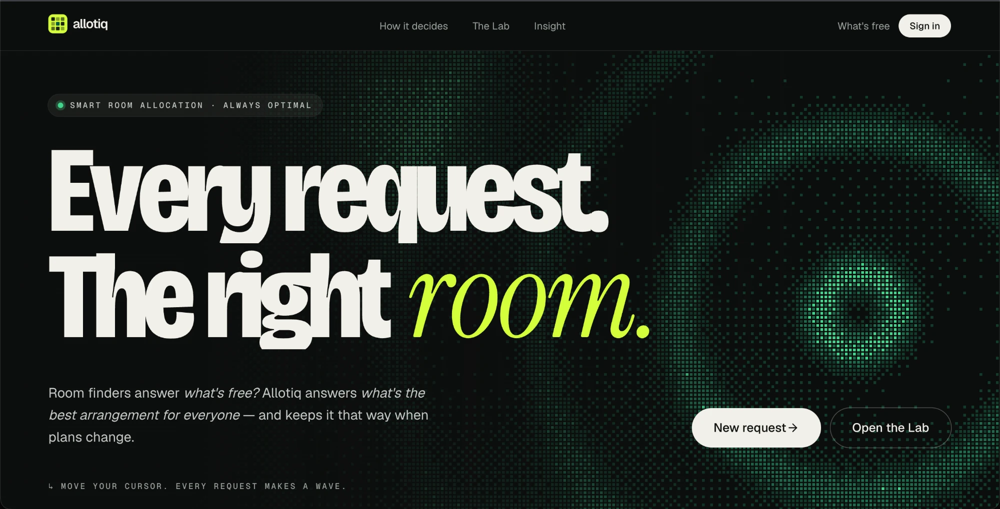
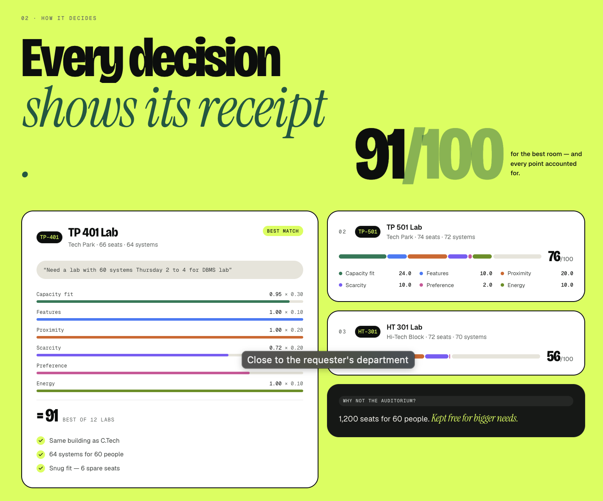
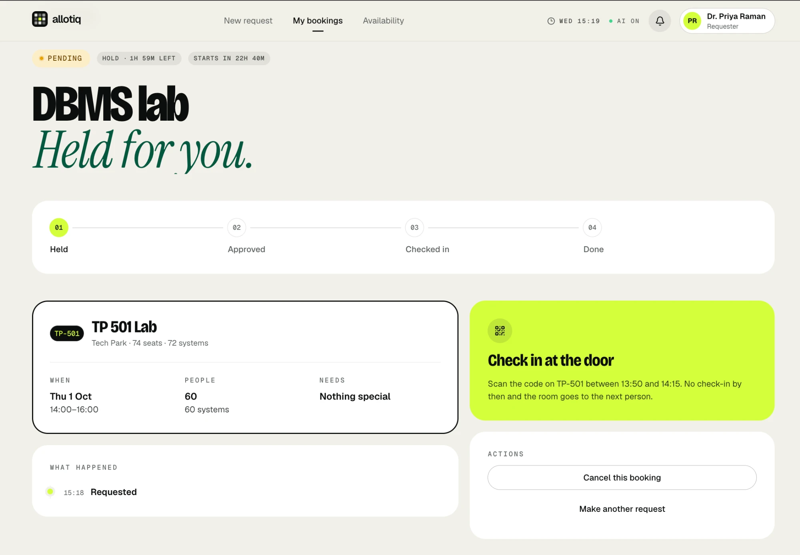

<div align="center">

# Allotiq

**Every request. The right room. Even when plans change.**

Room finders answer *"what's free?"*. Allotiq answers *"what's the best arrangement for everyone?"* — and keeps it optimal through no-shows, maintenance and priority requests.

Vision2Web 2026 · SRMIST · Industry Innovation 2 — Smart Resource Allocation System

[Contracts](docs/CONTRACTS.md) · [Deploy runbook](docs/DEPLOY.md)

</div>



## Why Allotiq

Most campus booking tools are first-come, first-served: whoever asks first gets the big room, and the next request
has nowhere to go. Allotiq looks at every open request together and picks the arrangement that serves the most
people well. On the brief's own fixture, FCFS places **2 of 3** requests; the engine places **3 of 3**.

- **Ask in plain words.** *"Need a lab with 60 systems Thursday 2 to 4 for DBMS lab"* — typed or spoken — becomes a structured request.
- **Every decision shows its receipt.** Each room gets a score out of 100 with a line-by-line breakdown, plus why the obvious alternative lost.
- **Stays optimal when plans change.** No-shows release rooms at the check-in deadline, maintenance re-homes affected bookings, and priority requests can bump with a counter-offer.
- **Built for the door.** QR check-in on a phone; a mobile-first approver queue.

## How it decides



Hard constraints first (capacity, required features, blackouts, no overlaps — enforced again by a Postgres exclusion
constraint), then a weighted soft score:

| Component | Weight | Rewards |
|---|---:|---|
| Capacity fit | 0.30 | A snug room — no 1,200-seat auditorium for 60 people |
| Proximity | 0.20 | Rooms close to the requester's department |
| Scarcity | 0.20 | Leaving rare rooms free for bigger needs |
| Features | 0.10 | Nice-to-have features the room has |
| Preference | 0.10 | Rooms the requester has used before |
| Energy | 0.10 | Buildings that are already lit in that slot |

Four interchangeable solvers sit behind one interface: `fcfs` (baseline), `greedy`, `bnb` (branch-and-bound, the
default) and `ilp` (stretch). **The Lab** (`/admin/lab`) runs them side by side on the same requests so you can
see the difference.

## The booking lifecycle



**Held → Approved → Checked in → Done.** A request is held while it waits for approval, the requester checks in by
scanning the room's door QR inside the window, and anything left unclaimed goes to the next person on the waitlist.
The full state machine lives in [docs/CONTRACTS.md](docs/CONTRACTS.md).

## Roles

| Role | Lands on | Does |
|---|---|---|
| Faculty · Club · Student | `/r/new` | Request a room, track bookings, check in |
| Approver | `/approvals` | Approve or decline held requests |
| Admin | `/admin/dashboard` | Rooms, disruptions, the Lab, analytics, audit log, demo controls |

## Stack

Next.js 16 (App Router, TypeScript) · Tailwind + shadcn/ui · Supabase (Postgres, Auth, Realtime, pg_cron) ·
Groq (optional AI layer: parsing, voice, explanations, insights) · Vercel.

The AI layer is optional: with `GROQ_DISABLED=true` or no key, parsing, explanations and Ask fall back to
deterministic versions. Voice needs the key.

## Getting started

```bash
npm install
cp .env.example .env.local   # fill in Supabase + Groq keys
npm run dev                  # http://localhost:3000
```

| Script | What it does |
|---|---|
| `npm run dev` | Dev server |
| `npm run typecheck` | Generate route types + `tsc --noEmit` |
| `npm run lint` | ESLint |
| `npm test` | Engine unit tests (Vitest) |
| `npm run seed` | Wipe activity and seed catalog, 4-week history and demo scenarios (`-- --dry-run` to preview) |
| `npm run db:types` | Regenerate Supabase types (after a migration) |

See [`.env.example`](.env.example) for every variable and [docs/DEPLOY.md](docs/DEPLOY.md) for production setup.

## Demo tips

- Every screen works before the backend lands: any endpoint that still answers `501` is served by the mock backend in
  `src/lib/mock` (state lives in your browser).
- **Ctrl + .** opens the demo controls anywhere — virtual clock, jump to 14:16, reset, switch persona.
- `/admin/demo` has the scene shortcuts and the judges' QR.
- `/login?as=approver` signs straight in.

## Project structure

```
docs/CONTRACTS.md            Team rules, lifecycle, ownership — read first
supabase/migrations/         Schema, exclusion constraint, triggers, RLS, apply_plan()
scripts/seed/                Catalog, 4-week history, demo scenarios
src/
  contracts/                 Shared types + Zod schemas (frozen)
  engine/                    Allocation engine — pure TS (feasibility, scoring, solvers, bump/rehome/waitlist)
    solvers/                 fcfs · greedy · bnb (default) · ilp (stretch)
    __tests__/               Brief fixture: FCFS 2/3 vs engine 3/3
  server/engine-adapter.ts   DB rows ↔ engine types, plans → apply_plan()
  lib/
    api/                     Typed API client — the only way screens reach /api (falls back to mock on 501)
    mock/                    In-browser mock backend: sample bookings + canned engine/AI answers
    seed/                    Catalog + history generator (shared by the DB seed and the mock)
    ai/                      Groq: parse, transcribe, explain, ask, insight (+ fallbacks)
    analytics/               analytics_* wrappers (dashboard + "ask" tools)
    auth/ db/ requests/ jobs/  Session, Supabase clients, transition(), minute tick
    clock.ts notify.ts http.ts
  hooks/                     Realtime hooks (notifications, live request)
  components/ui/             shadcn primitives
  components/kit/            Allotiq design kit (tokens, AppShell, KPI, status, score, dither)
  proxy.ts                   Session refresh + auth redirect (Next 16 "proxy")
  app/
    (auth)/login  join/      Sign in, judge QR join
    r/  r/new  r/[id]        Requester: my bookings, new request, status
    availability/            Day grid
    approvals/               Approver queue (mobile-first)
    c/[roomCode]/            QR check-in (mobile-first)
    admin/                   resources · lab · disruptions · dashboard · audit · demo
    api/                     Route handlers (see docs/CONTRACTS.md)
```
